# Metagenomic screening pipeline run order

Source: `CW_metagenomic_screening` (commit `a1c8bcb`), fetched via that repo's
`dashboard-export/` on 2026-10-08. For the conceptual "why does this exist"
explanation, see the [Metagenomic Screening guide](metagenomic-guide.html)
instead — this page is the technical run order, mirroring the
[SNP pipeline](pipeline.html) page's format.

```mermaid
flowchart TD
    subgraph CW["the_coffee_wrecks (source data)"]
        BAM["bwa-out/SAMPLE_sorted.bam
R0003, R0004 -- precise mode"]
        FASTQ["raw fastq.gz
R0002, R0005 -- approximate mode
(BAMs cleaned up earlier; less than 1% mapping
rate makes raw-read subsample ~equivalent)"]
    end

    BAM --> SUB["subsample_unmapped.sh
samtools view -f 4 | samtools fastq | seqtk sample
(streamed -- never writes the full
unmapped set to disk)"]
    FASTQ --> SUB
    SUB --> FQ["results/SAMPLE/SAMPLE_subsample.fq.gz
2,000,000 reads"]

    FQ --> K1["run_kraken2.sh
vs kraken2_db/ (PlusPF-8, prebuilt)"]
    FQ --> K2["run_kraken2_coffee.sh
vs coffee_kraken2_db/
C. arabica + 2 diploid parents (built here)"]

    K1 --> R1["SAMPLE_kraken2_report.txt
environmental / contamination profile
~95% unclassified; sediment/soil bacteria
+ trace human"]
    K2 --> R2["SAMPLE_kraken2_coffee_report.txt
559/2M (R0003), 607/2M (R0004)
classified as Coffea"]

    R2 --> EXTRACT["extract_coffee_hits.sh
seqtk subseq on classified read IDs"]
    EXTRACT --> HITS["SAMPLE_coffee_hits.fq.gz"]
    HITS --> ALIGN["align_and_mapdamage.sh
bwa aln -l 16500 -n 0.01
(same params as base pipeline)"]
    ALIGN --> RESULT["0/559, 0/607 aligned --
below the 10-read mapDamage floor,
mapDamage skipped (not just underpowered)"]

    RESULT --> INVESTIGATE["Direct investigation:
bwa mem re-alignment + NM/MAPQ +
manual sequence review"]
    INVESTIGATE --> GUESS["First pass (39-read subset, same day):
called it microsatellite repeats"]
    GUESS -.->|corrected, commit 8c5479c| RECHECK["Full 559+607 set re-aligned w/ bwa mem,
chain-clustered by position,
reference pulled at each cluster
(samtools faidx) and read directly"]
    RECHECK --> RRNA["10 of 12 largest clusters = bacterial 16S
rRNA (27F/515F primer motifs),
duplicated across several coffee
chromosomes + the mitochondrial contig
in the reference assembly itself"]
    RRNA --> CONCLUSION["Conclusion unchanged: still 0 aligned,
no recoverable coffee signal --
mechanism now verified, not guessed"]

    style R1 fill:#3a5a78,color:#fff,stroke:#2a4257
    style R2 fill:#1a7f1a,color:#fff,stroke:#145914
    style RESULT fill:#b8482f,color:#fff,stroke:#8f3722
    style GUESS fill:#888,color:#fff,stroke:#666,stroke-dasharray: 5 5
    style RRNA fill:#1a7f1a,color:#fff,stroke:#145914
    style CONCLUSION fill:#1a7f1a,color:#fff,stroke:#145914
```

| # | Script | Reads | Writes | Notes |
|---|--------|-------|--------|-------|
| 1 | `download_kraken2_db.sh` | — | `kraken2_db/` (PlusPF-8, ~5.5GB compressed) | One-time, run directly on the Roihu login node. |
| 2 | `download_coffee_taxonomy.sh` | — | NCBI taxonomy files for the coffee-specific DB build | One-time, feeds row 3. |
| 3 | `build_coffee_kraken2_db.sh` | *C. arabica* + *C. canephora* + *C. eugenioides* genomes | `coffee_kraken2_db/` | One-time. The two diploid parent species are included alongside the target since arabica is a natural hybrid of the two. |
| 4 | `subsample_unmapped.sh <SAMPLE>` | `the_coffee_wrecks/bwa-out/${SAMPLE}_sorted.bam` (precise mode, R0003/R0004) or raw `fastq.gz` (approximate mode, R0002/R0005 — BAMs already cleaned up by then, but statistically equivalent given <1% mapping rate) | `results/${SAMPLE}/${SAMPLE}_subsample.fq.gz` (2,000,000 reads) | Streamed throughout (`samtools view -f 4 \| samtools fastq \| seqtk sample`) — never materializes the full unmapped read set on disk. |
| 5 | `run_kraken2.sh <SAMPLE>` | Row 4's subsample, `kraken2_db/` | `${SAMPLE}_kraken2_report.txt` | The broad/contamination pass. ~95% unclassified for both samples checked; of the ~5% classified, dominated by sediment/soil/groundwater bacteria plus a trace (0.14–0.18%) of human DNA (normal handling contamination). |
| 6 | `run_kraken2_coffee.sh <SAMPLE>` | Row 4's subsample, `coffee_kraken2_db/` | `${SAMPLE}_kraken2_coffee_report.txt` | The direct coffee-match check — same subsample, dedicated 3-genome database. 559/2,000,000 (R0003, 0.028%) and 607/2,000,000 (R0004, 0.030%) classify somewhere under *Coffea*. |
| 7 | `extract_coffee_hits.sh <SAMPLE>` | Row 6's classified read IDs | `${SAMPLE}_coffee_hits.fq.gz` | `seqtk subseq`. |
| 8 | `align_and_mapdamage.sh <SAMPLE>` | Row 7's hits | Alignment result + mapDamage (if ≥10 reads align) | Same `bwa aln -l 16500 -n 0.01` parameters as the base pipeline. 0/559 and 0/607 actually aligned — below the 10-read mapDamage floor, so mapDamage is skipped outright, not just underpowered. |
| 9 | `run_screening.sh [SAMPLE...]` | — | Orchestrates rows 4–8 as an sbatch dependency chain per sample | Mirrors `the_coffee_wrecks/run_pipeline.sh`'s pattern. Defaults to all 4 samples if none given. |
| — | *Manual follow-up (not yet scripted)* | Row 8's 0-aligned result | `CW_metagenomic_screening/LABDIARY.md` entry, `coffee_hit_repeat_regions.json` | Re-aligned the full classified set (not a subsample) with `bwa mem` (soft-clip tolerant, unlike the pipeline's own `bwa aln`), chain-clustered by genomic position (≤500bp between neighbors), then pulled the reference sequence at each of the 12 largest clusters directly (`samtools faidx`) and read it by eye. 10 of 12 are unambiguous bacterial 16S rRNA gene fragments — e.g. the `NC_092313.1:77046430` cluster opens with `AGAGTTTGATCCTGGCTCAG`, the universal bacterial 27F primer sequence. Superseded a same-day first guess (microsatellite repeats, from eyeballing only a 39-read subset) — see commit `8c5479c`. Run by hand on Roihu; would need re-running manually for future samples. |

## What this answers

**Question:** does the base pipeline's alignment step throw away real, recoverable ancient coffee DNA among the >99% of reads that don't map to *C. arabica*?

**Answer: no — the exclusion is correct.** The unmapped fraction is dominated by environmental/soil bacteria, and the small slice that superficially classifies as *Coffea* resolves to a conserved bacterial 16S rRNA region duplicated inside the reference assembly itself (plausibly contamination carried into the draft assembly, or a NUMT-like nuclear copy — not confirmed which), not missed coffee signal. An ordinary environmental-bacteria read can pick up a stray "Coffea" k-mer hit purely from matching that shared conserved region.

## Known open issues (not fixed in this pass)
- R0002/R0005 haven't been screened yet (per `CW_viz_pipeline/index.html`'s Metagenomic Screening section) — only R0003/R0004 have results as of this doc.
- The manual follow-up investigation (table row above) isn't scripted — re-running it for new samples means repeating the `bwa mem` + `samtools faidx` steps by hand on Roihu.
- This page is built from a point-in-time export (`dashboard-export/screening_summary.json`, `CW_metagenomic_screening` commit `a1c8bcb`), not a live sync — re-fetch from that repo if its findings change.
